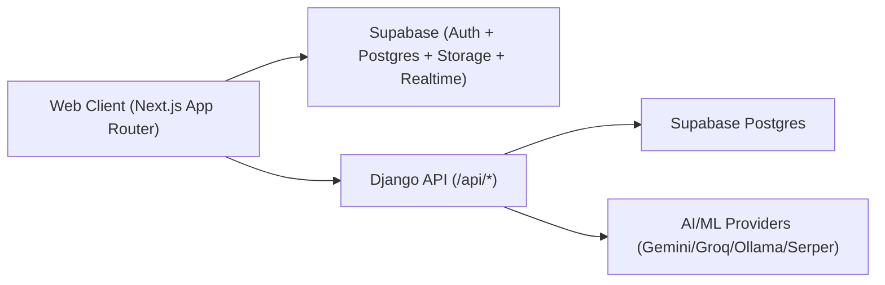

# FMT-ML Architecture Map

Last updated: 2026-03-05

This document captures the current architecture of the FMT-ML repository so future work can build on a shared technical baseline.

## 1) System Overview

FMT currently operates as a hybrid platform with two backends used in parallel:

- Supabase powers authentication, most app data reads/writes, real-time updates, and file storage.
- Django REST API powers ML/AI features and part of the core domain API.

High-level runtime model:



## 2) Repository Layout

```text
FMT-ML/
  backend/   Django + DRF + ML/AI modules
  frontend/  Next.js 14 App Router app
```

Key entry points:

- Backend: `backend/fmt_project/settings.py`, `backend/fmt_project/urls.py`, `backend/core/urls.py`
- Frontend: `frontend/app/layout.tsx`, `frontend/app/page.tsx`, `frontend/context/auth-context.tsx`

## 3) Tech Stack

### Frontend

- Next.js `^14.2.3`
- React `^18.3.1`
- TypeScript
- Supabase SSR/client SDK (`@supabase/ssr`, `@supabase/supabase-js`)
- Tailwind CSS
- Framer Motion

### Backend

- Django `4.2.8`
- Django REST Framework `3.14.0`
- drf-yasg (Swagger/ReDoc)
- PostgreSQL via `dj-database-url`
- scikit-learn, pandas, numpy, textblob

## 4) Backend Architecture (Django)

### 4.1 Routing Surface

Base mapping:

- `/api/` -> `core.urls`
- `/swagger/`, `/redoc/` -> API docs

Core endpoints include:

- CRUD viewsets: `/profiles/`, `/students/`, `/tutors/`, `/subjects/`, `/sessions/`, `/ratings/`
- Recommendations: `/recommendations/`, `/recommend/`, `/recommend/health/`
- Sentiment: `/analyze-review/`, `/analyze-reviews/batch/`, `/tutor/<id>/sentiment/`
- Pricing: `/predict-price/`, `/market-analysis/`, `/debug/db-check/`
- Study planner: `/generate-plan/`, `/study-tips/`, `/estimate-time/`
- AI chat: `/ai/quick-tutor/`, `/ai/tutor-command/`
- Courses: `/courses/`, `/courses/<course_id>/`, `/courses/enroll/`, `/courses/join-by-code/`

### 4.2 Data Model Mapping

`backend/core/models.py` maps Django models to existing Supabase tables with `managed = False`.

Mapped tables:

- `profiles`
- `students`
- `tutors`
- `subjects`
- `sessions`
- `ratings`
- `courses`
- `enrollments`
- `course_sessions`
- `course_resources`

### 4.3 ML/AI Modules

- `backend/api/ml/recommender.py`: singleton TF-IDF recommender loading artifacts from `backend/saved_models/*`
- `backend/api/ml/train_model.py`: training pipeline for recommender artifacts
- `backend/core/pricing.py`: linear regression price prediction + market analysis
- `backend/core/sentiment.py`: review sentiment analysis
- `backend/core/study_planner.py`: cascading AI plan generation with fallbacks
- `backend/core/ai/quick_tutor.py`: quick tutor chat endpoint with provider fallback
- `backend/core/ai/tutor_assistant.py`: tutor command center endpoint with provider fallback
- `backend/core/serper_service.py`: search grounding helper

Provider strategy (observed):

- Quick Tutor: Gemini -> Groq -> Ollama -> Serper-only -> mock fallback
- Tutor Command: Gemini -> Groq -> Ollama -> Serper-smart -> mock fallback
- Study Planner: Gemini/Groq/Ollama -> Serper-smart template -> generic template fallback

### 4.4 Backend Security/Config Notes

- DRF default permission is `IsAuthenticated`, but many endpoint classes/functions explicitly use `AllowAny`.
- `settings.py` prints debug/env diagnostics at startup (includes database URL presence state).
- `.env.example` currently includes a concrete-looking database credential string and should be sanitized.

## 5) Frontend Architecture (Next.js)

### 5.1 Route Map

Public:

- `/`
- `/login`
- `/tutors`
- `/api-test`

Student:

- `/student/dashboard`
- `/student/search`
- `/student/tutors`, `/student/tutors/[id]`
- `/student/schedule`
- `/student/messages`
- `/student/notifications`
- `/student/settings`
- `/student/progress`
- `/student/study-planner`
- `/student/quick-tutor`
- `/student/courses`
- `/student/my-courses`
- `/student/complete-profile`

Tutor:

- `/tutor/dashboard`
- `/tutor/requests`
- `/tutor/students`
- `/tutor/messages`
- `/tutor/notifications`
- `/tutor/settings`
- `/tutor/earnings`
- `/tutor/courses`
- `/tutor/smart-pricing`
- `/tutor/complete-profile`

### 5.2 Auth and Session Model

- `AuthProvider` reads session from Supabase and listens to auth state changes.
- Student/tutor layouts perform client-side redirect to `/login` when unauthenticated.
- No `middleware.ts` route guard exists currently.

### 5.3 Data Access Layers (Current)

The frontend currently uses multiple overlapping patterns:

- Direct Supabase calls from pages/components and server actions.
- Central API helpers:
  - `frontend/utils/api/client.ts`
  - `frontend/hooks/client.ts`
  - `frontend/hooks/useApi.ts`
- Direct `fetch` to Django endpoints using `API_BASE`.
- AI service modules:
  - `frontend/services/aiService.js` (uses `API_BASE`)
  - `frontend/src/services/aiService.js` (hardcoded `http://127.0.0.1:8000/api`)

This mixed access pattern is the main architecture complexity in the frontend.

## 6) Data Ownership and Table Usage

Tables used heavily from frontend Supabase calls include:

- `profiles`, `students`, `tutors`, `subjects`, `ratings`
- `bookings`, `messages`, `notifications`, `notification_settings`, `user_settings`, `tutor_requests`, `reviews`
- `courses`, `enrollments`, `course_sessions`, `course_resources`, `student_submissions`
- Storage buckets observed: `avatars`, `Profile Picture`, `student material`, `Class materials`

Important boundary:

- Django models currently cover only part of this schema (10 mapped tables).
- App-critical tables such as `bookings`, `messages`, and `notifications` are Supabase-only in current backend design.

## 7) Core Runtime Flows

### 7.1 Signup/Profile Flow

1. User signs up via Supabase auth in frontend.
2. Frontend calls `/api/auth/create-profile` (Next API route).
3. Route uses service-role Supabase client to create `profiles` row.
4. App routes by user role.

### 7.2 Student Recommendation Flow

1. Student UI (`components/study-planner/SmartRecommendations.tsx`) calls Django `/recommendations/`.
2. Backend computes cache key using student id + goals hash.
3. Recommender returns ranked tutors.
4. Frontend renders cards and deep-links to tutor profile pages.

### 7.3 Study Plan Flow

1. Student submits planner form on `/student/study-planner`.
2. Frontend calls Django `/generate-plan/`.
3. Backend cascades through LLM providers, then fallback strategies.
4. Plan response returned with metadata for UI display.

### 7.4 Courses Flow

Both systems are involved:

- Django exposes course listing/detail/enroll/join-by-code APIs.
- Frontend also performs direct Supabase reads/writes for course/session/resource/submission data.

## 8) Known Architecture Risks (Current State)

### 8.1 Contract Drift Between Django Views and Models

Observed mismatches in `backend/core/views.py`:

- Ordering fields reference columns not present on mapped models:
  - `created_at` on `Student`/`Tutor`
  - `scheduled_at` on `Session` (model uses `scheduled_time`)
  - `rating` on `Rating` (model has `overall_rating` and component ratings)
- Tutor rating aggregation uses `Avg('rating')` while model uses `overall_rating`.

Impact: query/order/action endpoints can fail at runtime or return incorrect behavior.

### 8.2 Recommender Function Signature Drift

- `backend/core/views.py` uses:
  - `get_recommendations(query=..., max_price=..., top_n=...)`
- `backend/api/ml/recommender.py` defines:
  - `get_recommendations(student_id=None, custom_query=None, top_n=10)`

Impact: recommendation endpoint path can fail with unexpected keyword argument errors.

### 8.3 Frontend Field Inconsistency

- `avatar` and `avatar_url` are used inconsistently across actions/pages/types.
- `actions/settings.ts` updates `profiles.avatar_url` while most code reads `profiles.avatar`.

Impact: profile images can appear stale/missing depending on path used.

### 8.4 Storage Bucket Naming Drift

Multiple bucket names exist, including names with spaces:

- `avatars`
- `Profile Picture`
- `student material`
- `Class materials`

Impact: environment setup and permissions become fragile; wrong bucket name silently breaks uploads/downloads.

### 8.5 Server Action Auth/Admin Misuse Risk

- `frontend/app/actions.ts` calls `supabase.auth.admin.*` while importing standard server client (`createClient`) rather than explicit admin client.

Impact: these paths are likely to fail in non-service-role contexts and create privilege ambiguity.

### 8.6 Duplicate/Legacy Components and Clients

- Duplicate recommendation components:
  - `components/study-planner/SmartRecommendations.tsx`
  - `components/SmartRecommendations.jsx` (legacy hardcoded `user_id=1`)
- Duplicate AI service modules with different base URL behavior.

Impact: hard-to-predict behavior and accidental usage of stale code paths.

### 8.7 Testing Gap

- No project-owned automated test suites detected for frontend/backend behavior.

Impact: high regression risk while refactoring integration layers.

## 9) Build Guardrails for Next Work

To keep upcoming development safe and fast, treat these as near-term guardrails:

1. Choose one canonical data path per feature:
   - Supabase-first or Django-first, not both in same request path.
2. Consolidate API clients:
   - single Django API client
   - single Supabase client pattern (browser/server/admin explicit)
3. Freeze schema contracts:
   - normalize `avatar` field usage
   - align Django view ordering/filter fields to real model columns
4. Remove/retire duplicate legacy modules (`src/services/aiService.js`, old recommendations component) once usage is confirmed.
5. Add minimal integration tests for:
   - recommendations endpoint
   - signup profile creation
   - course enrollment and uploads

## 10) Recommended Next Execution Order

1. Stabilize contracts first (backend view/model mismatches + recommender signature).
2. Unify frontend API layer and deprecate duplicate clients.
3. Standardize storage bucket names and avatar field mapping.
4. Add smoke tests around the highest-traffic flows before new feature expansion.

